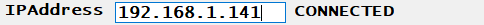
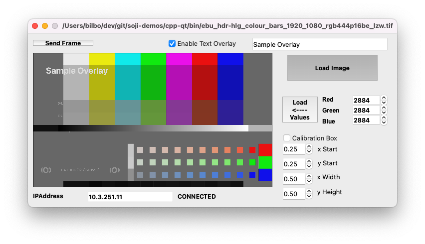
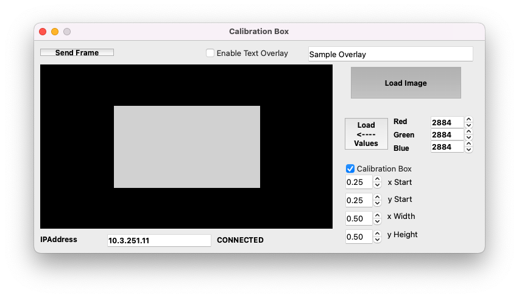
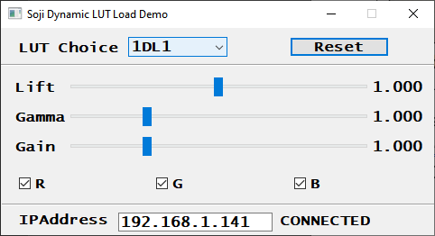
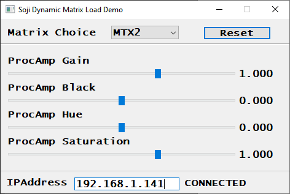
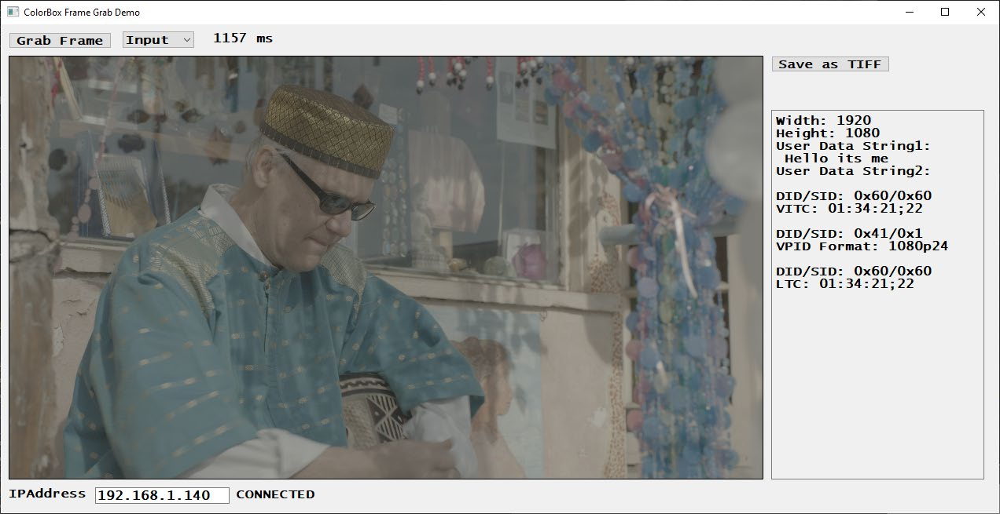
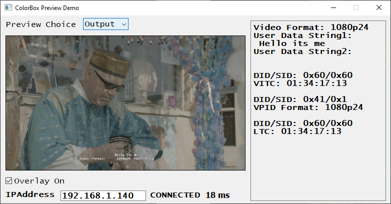
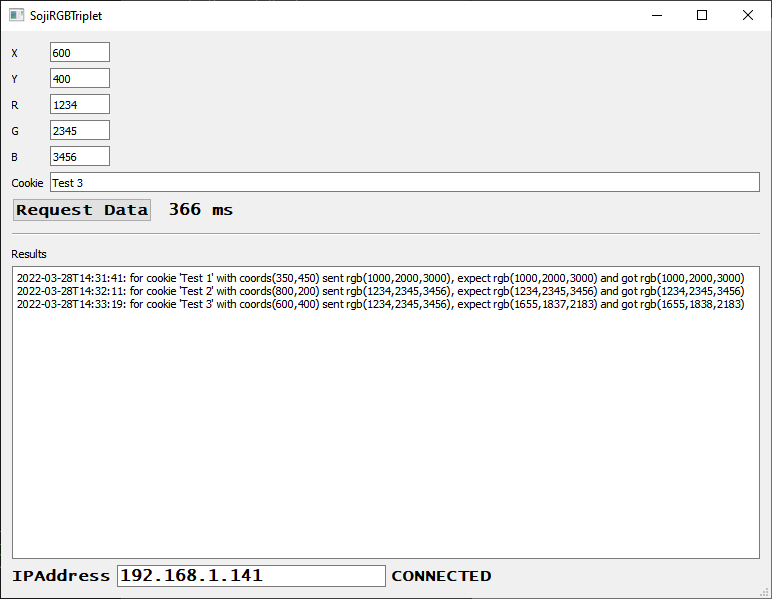
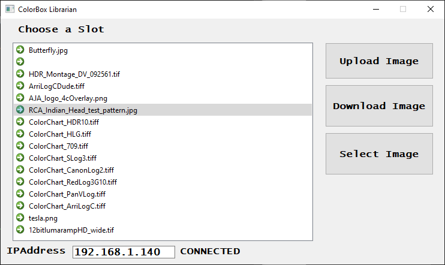

Last update: 09/09/2022

# Qt C++ Demo Projects
There are 7 Qt C++ demos included.

Each demo project requires the user to enter the IP Address of the ColorBox Converter. To do so just type in the IP Address and press return. Before you enter the address, it will look like this:


After it will show it is connected and the IP Address:



The [Qt C++ api](api) is used for these demo projects. This API uses Qt signals and slots. For every call into the API the client will get a signal on success and different signal if there is an error. For example, as a response to the getFrameStore API call these connects should be made.
```
// API related slots
connect(&_api, &OAIDefaultApi::getFrameStoreSignal, this, &Dialog::handleGetFrameStore);
connect(&_api, &OAIDefaultApi::getFrameStoreSignalE, this, &Dialog::handleGetFrameStoreError);
```

On success, `handleGetFrameStore` will be called and on error, `handleGetFrameStoreError` will get called.

If you are just setting a parameter you don’t need to have a signal/slot setup but it is recommended in
shipping code so any error can be logged.

## Building C++ Qt Demo Projects
The preferred method of building the C++ demo projects is cmake with Qt Creator. In addition, there is a [demos.pro](demos.pro) file that can be used with qmake with Qt Creator.

To build with cmake you need a cmake enabled Qt Creator kit(for M1 Mac you need Qt 6.2.4). For all other platform 5.15.2 or later should be fine.

1. clone this repository on your local machine (on windows make sure path is not too long as windows has a path limit of 250).
2. Get [github opensource ntv2 sdk](https://github.com/aja-video/ntv2/archive/refs/tags/v16.2-bugfix5.zip) unzip and put it in **cpp-qt/ntv2sdk** so that ajalibraries is right below ntv2sdk.
**Note,** on Linux line 455 of [ntv2sdk/ajalibraries/ajantv2/CmakeLists.txt](ntv2sdk/ajalibraries/ajantv2/CmakeLists.txt) needs to be changed to: `rt pthread)`
3. Open Qt Creator and open cpp-qt/CMakeLists.txt.
4. Right-click on ”Project” and run cmake.
5. Right-click on ”Project” and run Build

**NOTES:**
	
* Step 2 is optional and only used by FrameGrab and PreviewDemo for ancillary data packet detection and decoding.
* Linux demos will need to have libtiff installed
* MacOS demos needs libtiff and pkg-config via homebrew
* Windows demos come with libtiff in package

### DynamicFrameLoad
This demo shows how to transfer an image to ColorBox over WebSockets and the RESTful API. The RESTful API allows the ColorBox to go into Dynamic “Store” mode and set a Video Format. The WebSocket is then used to transfer the image.



In the demo, the image can come from a flat matte by loading RGB Values or from a 16 bit Tiff file. The image needs to be a 16 bit RGB image in memory that is transferred via WebSockets to the ColorBox. Once that ColorBox is Connected simply press the “Send Frame” button and the ColorBox will go into Dynamic Frame Store mode and the image will be updated. For this demo the ColorBox format is set to 1080p23.98 but it can be set to “AUTO” to follow the input format. For the WebSocket transfer to work the raster size of the image needs to match the current video format raster size on the ColorBox.

The demo also allow for description of a "Calibration" box to be sent via the API to ColorBox


For implementation details see [DynamicFrameLoad/dialog.cpp](DynamicFrameLoad/dialog.cpp)
Please read the comments at the top of the file for some more information.

### DynamicLutLoad
This demo shows how to dynamically load any of the 1D LUTs or 3D LUT on the ColorBox Pipeline via WebSockets and the RESTful API. The RESTFul API is used to make the “LUT Choice” and to set that LUT into Dynamic transfer mode. The WebSocket is then used to transfer either a 1DLUT or 3DLut. In this case the 3DLUT is derived from the 1DLUT for demo purposes.



See the top of [DynamicLutLoad/dialog.cpp](DynamicLutLoad/dialog.cpp) for implementation details.

### DynamicMatrixLoad
This demo shows how to dynamically load any of the 3x4 Matrices on the ColorBox Pipeline via WebSockets and the RESTful API. The RESTFul API is used to make the “Matrix Choice” and to set that LUT into Dynamic transfer mode. The WebSocket is then used to transfer the matrix coefficients. For ease QMatrix4x4 is used in this demo.



See the top of [DynamicMatrixLoad/dialog.cpp](DynamicMatrixLoad/dialog.cpp) for implementation details.

### FrameGrab
The FrameGrab Demo shows how to use WebSocket messaging to get an uncompressed full size frame grab from the ColorBox. The demo can also be setup to get the associated ancillary metadata for that frame and decode it using the NTV2 API.

The demo allows the capture of the unprocessed(but color space converted) Input or capture the processed Output(if overlay is on then the overlay is also transferred).



See the top of [FrameGrab/dialog.cpp](FrameGrab/dialog.cpp) for implementation details.

### PreviewDemo
The PreviewDemo uses the RESTful API to get a proxy jpg preview of the ColorBox. The demo can also be setup to get the associated ancillary metadata for that frame and decode it using the NTV2 API.

In addition, the demo demonstrates how to use the PreviewTap…The PreviewTap can be set to either Input or Output. If it is set to Input then the retrieved preview is before an ColorBox processing has been done. If it is set to Output, then the pipeline processing has been done before the preview image is sent back. In addition, if the Overlay checkbox is set the overlay will be applied to the preview image as well.



See the top of [PreviewDemo/dialog.cpp](PreviewDemo/dialog.cpp) for implementation details.

### RGBTriplet
This demo shows how to download a 16 bit RGB Triplet to the ColorBox to a particular pixel location and then read back that pixel location having applied the current transforms. For instance, if ColorBox is in LUT mode the API will place the RGB triplet in the frame store and the ColorBox Software will calculate the expected results of that RGB triplet running through the pipeline

1DLUT -> 3x3 Matrix -> 3DLUT -> 1DLUT -> 3x3 Matrix-> 1DLUT

and report back both the expected and actual results. For this to work the Pipeline needs to be in “Frame Store” mode and not being updated with Input Video. This will also work with the Orion and Colorfront engine.



See the top of [RGBTriplet/dialog.cpp](RGBTriplet/dialog.cpp) for implementation details.

### Librarian
This demo shows how to interface to the ColorBox Library. The Library consists of 1DLUTs, 3DLUTs, 3x3Matix and Images. This demo focuses on Images but similar code can be used for the other Elements.



See the top of [Librarian/dialog.cpp](Librarian/dialog.cpp) for comments on the implementation.

#### Updates
**03/31/2022** - Added Calibration API, and update DynamicFrameLoad to demonstrate it.

**09/09/2022** - Converted this documentation into markdown. Split the document up, some of it is now in the root level [README.md](../README.md)

**08/11/2022** - Added Librarian demo and updated doc with more info.

**07/19/2022** - Updated FrameGrab demo so it can control to capture the unprocessed Input vs. the processed Output.

**07/11/2022** - Updated PreviewDemo so it can control PreviewTap(Input vs. Output) and Overlay On/Off.